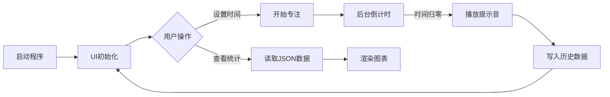

# 📘 代码使用全景图文档

> **项目名称**：PomodoroTimer
> **生成日期**：2026-02-06
> **文档说明**：本文档展示了系统的完整技术栈、运行流程及数据流转全景。

---

## 第一部分：项目环境与技术栈

### 📦 项目依赖环境
- **Python版本要求**：Python 3.9+ (当前检测: 3.10.19)
- **操作系统支持**：Windows / macOS / Linux (跨平台)
- **核心依赖库列表**：

| 分类 | 库名称 | 说明 |
| :--- | :--- | :--- |
| **GUI 核心框架** | `customtkinter` | 现代化 UI 组件库，提供圆角与深色模式支持 |
| **标准库** | `tkinter` | Python 内置 GUI 基础库 |
| **并发处理** | `threading` | 用于倒计时后台线程，防止界面卡顿 |
| **数据存储** | `json` | 专注记录的轻量级持久化存储 |
| **系统交互** | `os`, `sys`, `platform` | 路径处理与跨平台音频播放策略 |
| **多媒体** | `winsound` (Win) / `os.system` (Mac) | 结束提示音播放 |

### 🔧 技术栈与核心库详解
#### 1. CustomTkinter (UI 层)
- **版本要求**: 5.0+
- **用途**: 构建主窗口、悬浮窗、按钮及进度条。
- **核心组件**: `CTk`, `CTkToplevel`, `CTkButton`, `CTkLabel`。
- **关键场景**: 用户设置时间、显示倒计时、切换统计面板。

#### 2. Threading (并发层)
- **版本要求**: 内置
- **用途**: 分离 UI 渲染与计时逻辑。
- **核心组件**: `Thread(daemon=True)`。
- **关键场景**: 点击“开始专注”后，启动后台线程执行 `while` 循环倒计时。

### 🚀 环境安装指南
#### 快速安装命令
```bash
# 1. 创建虚拟环境 (推荐)
python -m venv venv
# Windows 激活
venv\Scripts\activate
# macOS/Linux 激活
source venv/bin/activate

# 2. 安装核心依赖
pip install customtkinter
```

#### 验证安装
运行以下命令，若弹出窗口且无报错即为成功：
```bash
python main.py
```

### 💻 系统要求
- **硬件**: 任意支持 Python 的 PC/Mac。
- **显示**: 支持 1000x650 分辨率及以上。
- **音频**: 需配备扬声器以播放结束提示音。

---

## 第二部分：代码使用全景图

### 1. ⚡ 极简版总览（完整流程）


### 2. 按时间轴展开详细流程

#### 🕒 阶段一：系统启动与初始化
- **📊 数据管道流程图**：
```text
┌──────────────┐       ┌──────────────┐       ┌──────────────┐
│   main.py    │ ───→  │  src/ui.py   │ ───→  │ src/config.py│
└──────┬───────┘       └──────┬───────┘       └──────┬───────┘
       │                      │                      │
       ↓                      ↓                      ↓
 [程序入口实例化]      [加载窗口与组件]       [读取全局配色/字体]
```
- **📂 核心脚本**：`main.py`, `src/ui.py`, `src/config.py`
- **⏱️ 预估耗时**：< 1秒
- **🎯 功能说明**：初始化 `PomodoroApp` 类，设置窗口居中、置顶策略及主题颜色。
- **⚠️ 重要提醒**：若缺少 `assets/icon.ico`，图标加载通过 try-except 自动忽略。

#### 🕒 阶段二：专注任务执行 (核心循环)
- **📊 数据管道流程图**：
```text
┌──────────────┐       ┌──────────────┐       ┌──────────────┐
│ 用户点击开始  │ ───→  │ src/core.py  │ ───→  │  GUI 更新    │
└──────┬───────┘       └──────┬───────┘       └──────┬───────┘
       │                  (线程启动)                 │
       ↓                      ↓                      ↓
 [获取输入时间]        [While循环倒计时]       [实时刷新 00:00]
```
- **📂 核心脚本**：`src/ui.py` (事件绑定), `src/core.py` (无直接逻辑，逻辑在UI类中)
- **🎯 功能说明**：
    1. UI 线程挂起，开启悬浮窗。
    2. 子线程每秒 `sleep(1)` 并递减 `time_left`。
    3. 实时更新 `StringVar` 变量以刷新界面。
- **📥 输入数据**：用户在 GUI 选择的分钟数 (int)。
- **📤 输出状态**：界面倒计时数字变化。

#### 🕒 阶段三：任务结束与数据归档
- **📊 数据管道流程图**：
```text
┌──────────────┐       ┌──────────────┐       ┌──────────────┐
│  倒计时结束   │ ───→  │  播放音效     │ ───→  │ 数据持久化    │
└──────┬───────┘       └──────┬───────┘       └──────┬───────┘
       │                      │                      │
       ↓                      ↓                      ↓
 [触发完成事件]        [SoundManager]        [focus_history.json]
```
- **📂 核心脚本**：`src/ui.py` -> `src/core.py` (DataManager)
- **🎯 功能说明**：
    1. 播放跨平台提示音 (Windows Beep / Mac afplay)。
    2. 生成当前时间戳记录。
    3. 将 `{date, timestamp, duration}` 追加到 JSON 文件。
- **📥 输入数据**：本次专注时长 (minutes)。
- **📤 输出数据**：`focus_history.json` (追加写入)。
- **⚠️ 重要提醒**：文件读写采用 `r+` 模式，确保并发安全。

### 3. 📁 核心文件清单

| 功能模块 | 文件路径 | 核心类/函数 | 作用描述 |
| :--- | :--- | :--- | :--- |
| **🚀 入口** | `main.py` | `main()` | 程序启动入口 |
| **🎨 界面** | `src/ui.py` | `PomodoroApp` | 主窗口、侧边栏及交互逻辑 |
| **🎨 界面** | `src/ui.py` | `MiniFloatWindow` | 专注时的极简悬浮窗 |
| **⚙️ 配置** | `src/config.py` | `AppConfig` | 颜色常量、字体大小、窗口尺寸 |
| **🧠 内核** | `src/core.py` | `DataManager` | JSON 文件的读写与统计计算 |
| **🔊 媒体** | `src/core.py` | `SoundManager` | 跨平台声音播放封装 |
| **🛠️ 工具** | `src/core.py` | `ResourceManager` | 资源路径处理 (兼容打包后) |

### 4. 🎯 关键数据文件流转图

```text
       [用户交互]
           │
           ▼
    ┌─────────────┐
    │  src/ui.py  │  <── (读取配置) ──  src/config.py
    └──────┬──────┘
           │ (产生专注记录)
           ▼
    ┌─────────────┐                                ┌──────────────────┐
    │ src/core.py │  ──(序列化 JSON)──> [写入] ──→ │ focus_history.json │
    │ DataManager │                                └─────────┬────────┘
    └──────┬──────┘                                          │
           │                                                 │
           └────────────────── (读取统计) ────────────────────┘
                              (反序列化)
                                  │
                                  ▼
                            [UI 统计面板展示]
```

### 5. 📌 使用说明

#### 如何查找特定功能？
- **想改颜色/字体**：直接修改 `src/config.py`，无需动逻辑代码。
- **想改倒计时逻辑**：查看 `src/ui.py` 中的 `_run_countdown` 方法。
- **想改数据存储格式**：修改 `src/core.py` 中的 `DataManager` 类。

#### 如何追踪数据流向？
打开 `focus_history.json`，每条记录格式如下：
```json
{
    "date": "2023-10-27",
    "timestamp": 1698391200.5,
    "duration": 25
}
```
系统通过计算 `date` 字段来匹配“今日”数据，通过 `timestamp` 计算“本周/本月”数据。

---
**文档自动生成于**：2026-02-06 14:20:42